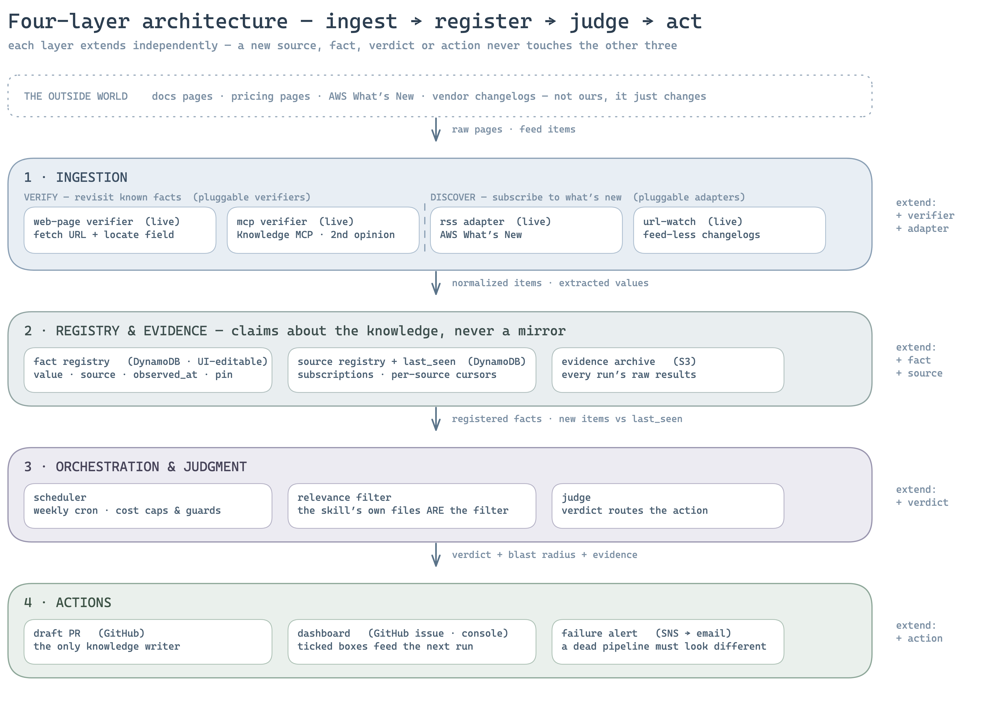
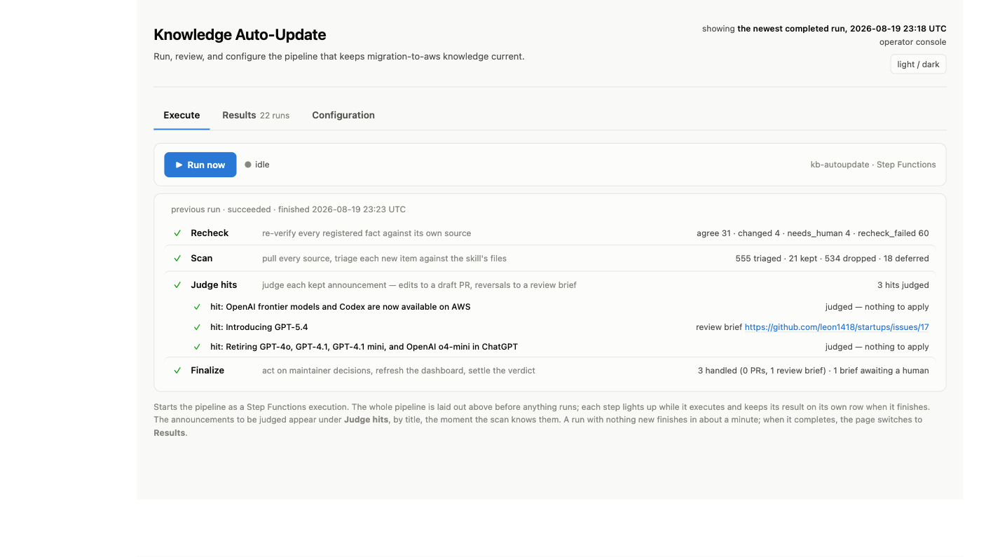
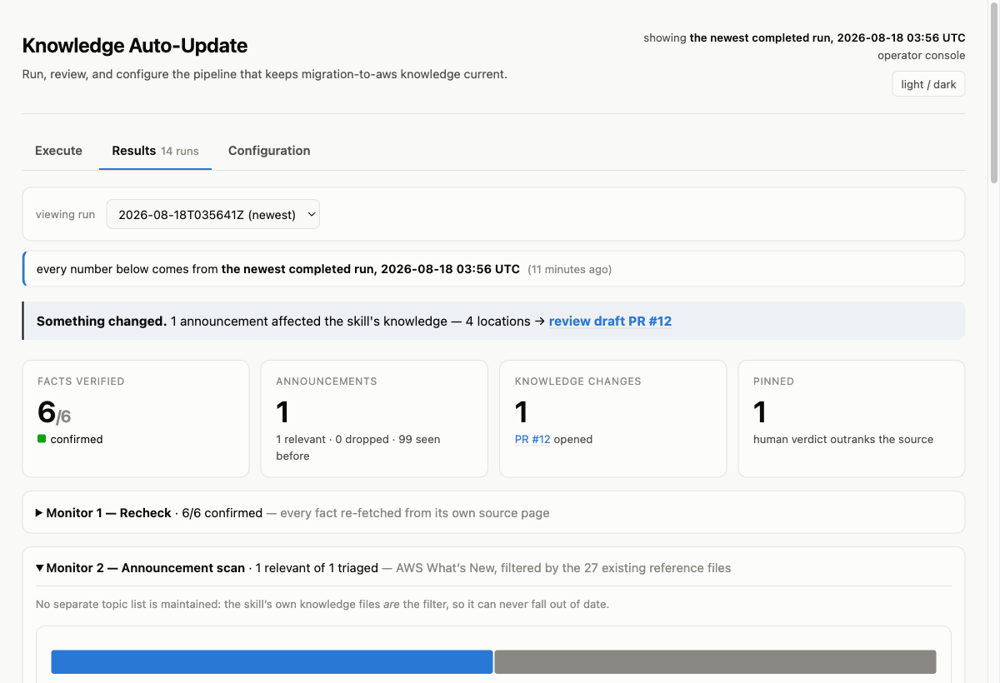
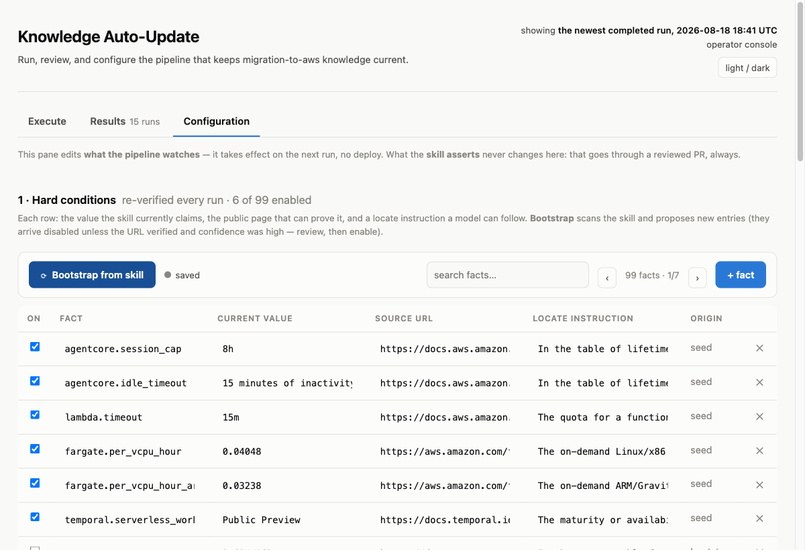

# Knowledge Auto-Update for Skills — Proposal & PoC validation

## 1. Problem statement

Our skills are prompt libraries whose value is the accuracy of the knowledge inside them. For
`migration-to-aws` alone that is ~50k lines of markdown across 258 files, and much of it asserts
facts about the outside world: service limits, prices, GA/preview status, model lifecycles.
The outside world moves; the files do not.

Two measured symptoms:

- **No provenance.** Of 176 non-vendored skill markdown files, 37 contain any URL and 8 carry a
  date marker. For most claims there is nothing a machine — or a new teammate — can re-verify.
- **Staleness is only found by accident.** Every stale-fact fix in the repo's history (#161
  classic Bedrock Agents entering maintenance mode, #97 Harness reaching GA, #131/#72 pricing
  and lifecycle refreshes) was a human happening to notice.

The worked example that shaped the design: AWS announced AgentCore runtime instances
(EC2-backed, 14-day sessions) on 2026-08-06. Four days later the skill still told users
">8 hours → don't use AgentCore, use ECS/EKS" and "AgentCore cannot host Temporal Workers" —
one stale fact had silently invalidated ~13 statements across two skills and reversed at least
three recommendations. The verification channel existed and worked; what was missing was
anything that runs unattended.

The cost is not hypothetical rework — it is wrong advice delivered confidently to users who
followed the skill's recommendation.

## 2. System architecture

The system watches the outside world on the skill's behalf: it re-verifies what the skill
already claims, discovers announcements that contradict it, judges what each change means,
and turns every verdict into a reviewable artifact. That work divides into four layers, each
independently extensible.



**Layer 1 — Ingestion.** Two intake modes, each with its own plug-in point:

- _VERIFY — revisit known facts (pluggable verifiers):_ each registered fact carries its own
  public source URL and a natural-language locate instruction ("in the lifetime-session table,
  the row whose Phase is 'Maximum session duration' — read its Timeout column"). Every run
  re-fetches the page and re-extracts that one field. The instruction is plain language instead of a CSS selector, so a page redesign
  that reshuffles the HTML does not break it; and the extracted value is compared by
  meaning rather than by string, so a page that rewords "15m" as "900 seconds" does not
  raise a false alarm.
  The web-page verifier is live, and so is a second, independent channel: on any non-agree
  outcome, the MCP verifier asks the hosted AWS Knowledge MCP server the same question and
  attaches what the docs say — value, verbatim quote, sources — as a second opinion for the
  reviewer. (Deliberately no verdict: its job is evidence, not judgment.)
- _DISCOVER — subscribe to what's new (pluggable adapters):_ two adapters are live — `rss`
  for real feeds (AWS What's New, AWS News Blog, OpenAI News) and `url-watch` for changelog
  pages without one (OpenAI API changelog, Anthropic release notes, Temporal changelog),
  which segments their date-headed entries deterministically so item identity stays stable
  across runs. All adapters normalize to one item shape, so downstream code never knows the
  source format.

**Layer 2 — Registry & Evidence.** A registry of _claims about_ the knowledge, in three stores:
a fact registry (DynamoDB, UI-editable — value, source, last-verified timestamp, human pins), a
source registry with per-source cursors (DynamoDB), and an evidence archive of every run's raw
results (S3). Deliberately *not* a mirror of the knowledge — the storage rule: reviewable
things live in git (the skill files remain the single authoritative copy), machine state lives
in one DynamoDB table and one S3 bucket. That split is what keeps
this system from creating the very drift it exists to fight. The registry is editable in the
operator console (it is operations data, like cursors); the knowledge itself is not.

**Layer 3 — Orchestration & Judgment.** Three parts. The _scheduler_ is a weekly cron
(deliberately weekly: the AWS What's New feed caps at 100 items at ~58/week, so a monthly poll
would silently drop entries) and owns the cost and runaway guards — per-run judge cap, global
grep caps, a ≥10× magnitude guard — all in code, not in the model. The _relevance filter_ keeps
no hand-maintained topic list, because a topic list is itself knowledge that goes stale: the
skill's own 27 reference files *are* the filter. The _judge_ reads the actual skill files for
every hit and answers two questions. First: what does this change mean? A value that moved
(`value_change`) is not the same as a fact whose shape changed (`schema_change`) — when a
single value splits into per-dimension values, part of the old value is usually still correct,
so the judge records what remains true instead of overwriting it. That "still true" clause is
exactly what a naive diff-and-rewrite lacks. Second: how far does it reach? The judge searches the whole tree for affected statements
rather than trusting file descriptions, because a file can depend on a fact without being
"about" it — and those are the files whose conclusions flip. When a conclusion does flip, the
judge writes one more thing: a _decision brief_ — what changed, the real options and what each
depends on, a proposed position, and every assumption that position rests on — because a
reversal opens a decision space (GA maturity, cost structure, workload fit) that no
line-level rewrite can carry.

**Layer 4 — Actions.** Independent consumers of judge output, and the only layer that writes
anywhere. The verdict decides which of two products a change becomes. A mechanical change — a
moved value, a derived sentence to update — becomes a draft PR. The PR is the only thing that
writes knowledge, under three rules: it touches only the locations the judge named, it
refuses any edit whose before-text is not actually in the file, and it lists every skipped
edit in its own body — so it can never pass for a complete or infallible change. A reversed
recommendation, or an announcement the judge could not classify, becomes a _review issue_
instead, carrying the decision brief; nothing is rewritten. The maintainer picks a decision
on the issue (adopt, adopt with changes, or reject), and the next run does the typing: it
propagates the approved position through the same blast-radius machinery and opens a draft
PR, which still gets reviewed. The human holds both gates — direction first, execution after
— and the machine does the mechanical middle. Around the two products sit the dashboard and
the alert. The dashboard is one long-lived GitHub issue rewritten every run (the operator
console shows the same state); it lists every brief still waiting on a decision, and a ticked
checkbox is a _request the next run acts on_, not a command executed on click — which is why
no API and no auth layer exist. The failure alert (SNS → email) exists because a quiet week
and a dead pipeline must look different. New actions — notify a channel, regenerate a doc,
target another repo — plug in without touching layers 1–3.

**Where AI ends and code begins.** This is a fixed pipeline, not an agent. A model is
consulted at exactly nine points, and every consultation has the same shape: code asks one
narrow question, the model must answer in a fixed JSON format, and code checks the answer
before it is allowed to do anything (e.g. is the quoted evidence really in the announcement? is
the price change within a plausible range? is the text to be replaced actually in the file?).
The model never decides what happens next — code does, and all nine questions are printed
verbatim in the appendix. We chose this over a tool-using agent deliberately: a fixed
pipeline has a cost ceiling you can compute, each of the nine judgment points can be tested
on its own, and when something goes wrong the failure is visible at a specific step instead
of buried inside an agent's loop.

**The human stays in charge.** Nothing merges without review, and nothing reversed is even
_drafted_ without a maintainer's position. A rejected conclusion is recorded as a _pin_ on the
fact (with the evidence that would lift it), so the system never re-proposes the same rejected
change weekly — the mechanism that already protects the one case where a vendor's own docs
were wrong.

## 3. POC Verification and deployment

We built the four-layer architecture above as a working POC and ran it against the real
world. The deployment is deliberately small — the whole pipeline is one CloudFormation stack
(~20 resources, Checkov clean, least-privilege verified by tests that failed for the right
reasons):


A run starts one of two ways: the operator console's Run now button (hosted, Midway-gated,
team-allowlisted — see the appendix) or the weekly EventBridge cron (deliberately DISABLED until a
few supervised weeks pass, §5.3). The run is a Step Functions execution with one Lambda behind
every state: each stage shallow-clones the branch (pushing code still deploys), and all state
lives in one DynamoDB table (registries, cursors, run history) and one S3 evidence bucket
(every run's raw results). Every stage — and every judged hit inside the Map state — is a
separately visible state, so progress is first-class instead of log-grepping. Failure has its
own channel — execution FAILED → EventBridge → SNS → email — so a dead pipeline cannot be
mistaken for a quiet week.

On the GitHub side the pipeline only ever produces reviewable artifacts: draft PRs,
review-brief issues, and one long-lived dashboard issue. `main` changes only through reviewed
PRs; the pipeline never merges. The POC has so far run against a maintainer's fork, which means zero footprint on
`awslabs/startups` — no secret, no workflow, no bot branch, and the GitHub token is
fine-grained to the fork, returning 403 anywhere else _by construction_. Retargeting the real
repo is a two-parameter change plus an org-scoped token (§5.2).


Everything below was verified against the real world: live feeds and pages, real Bedrock
models (Haiku for extraction and triage, Sonnet for judgment), real PRs and issues on GitHub.
A single run exercises all four layers. On the discovery side, every kept announcement ends
in exactly one of three places: nothing (the judge found no change to make), a draft PR (a
mechanical edit, ready for review), or a review issue (a reversal or an unclear case, waiting
for a maintainer's decision). On the re-verification side the outcomes are simpler: a fact
that still checks out gets its timestamp refreshed; anything else is shown to a human
together with an independent second opinion — deliberately never auto-edited (§4).

| Claim                                                 | Evidence                                                                                                                                                                                  |
| ----------------------------------------------------- | ----------------------------------------------------------------------------------------------------------------------------------------------------------------------------------------- |
| Re-verification is reliable                           | 6 curated facts × 3 consecutive runs → identical verdicts, all `agree`, including "8h" vs "8 hrs" and unit-converted prices. At today's 99 facts the ~60 recheck failures are prose-extracted records with bad URLs or locate instructions — surfaced for curation, never guessed at (§4)                                                               |
| It does not confuse "new option" with "changed value" | the same week runtime instances launched, recheck still reported `session_cap` `agree` — correct, because 8h still holds for microVMs                                                   |
| Discovery filters well without a hand-kept topic list | 100 feed items triaged against the skill's own 27 reference files → 12 kept / 88 dropped, the acceptance item among the kept; later, at six sources, 1,227 items in one run → 31 kept, all genuinely relevant                                       |
| The judge adds real information                       | `schema_change` verdict, 13 affected locations (manual analysis had found 8), 3 conclusions flagged as _reversed_, and an unprompted "still true" clause that prevented the wrong rewrite |
| The whole loop closes                                 | button-press → a 3–6 min Step Functions run, every stage and every judged hit visible as it executes → draft PR with per-edit justification. Re-verified end to end on the 2026-08-20 demo run: three announcements produced one draft PR, one flipped brief, and one needs_human brief, each linked from its own step                                                                       |
| Configuration is self-serving                         | two-pass bootstrap: 11 facts from the skill's declared volatile spots plus 84 typed claims extracted from prose (each with an HTTP-verified source URL, arriving disabled for human review) — the registry grew 6 → 99; UI edits are live on the next run |
| Failures retry instead of vanishing                   | a hit deferred by the per-run judge cap returned on the next run and produced its draft PR — "seen" means *handled*, not fetched, so a deferred hit, a crashed judge, or a dead build all come back automatically                                          |
| A reversal is a decision, not a rewrite               | flipped verdicts route to a four-section decision brief instead of a PR: on the runtime-instances case the brief named 4 real options and 8 explicit assumptions (GA maturity, unmodeled capacity-provider pricing, region limits) — and its proposed position warned against exactly the blanket rewrite a silent PR would have made. The first live brief opened the same day (an out-of-order GPT-5.4 replay the judge refused to guess about), and a genuine live reversal followed a day later — OpenAI models arriving on AWS flipped an availability recommendation, and its brief again proposed a caveated split, not a swap |
| A disagreement gets an independent second witness     | on any non-agree re-verification, the hosted AWS Knowledge MCP is asked the same question and answers with attributed evidence — value, verbatim quote, source URL — every quote mechanically validated against the result it cites (verified on the 9h-vs-8h fixture). Deliberately no verdict: evidence for the reviewer, not judgment |
| A coverage outage cannot impersonate a quiet week     | per-source fetch failures are recorded in every run's result, and when every enabled source fails the run itself fails → SNS email; partial loss stays visible in the archive and the console                                          |
| Pending work survives reruns                          | open review briefs and draft PRs are published to a standing list on the console and the dashboard, independent of whichever run is displayed — verified in the 2026-08-20 demo: the list kept its items across repeated runs until a human acted on them |
| Cost                                                  | ~$1–2 per full run at current caps (estimated from capped call counts — token usage is not yet instrumented); a quiet incremental run costs cents. Fixed cost ≈ the KMS key + one secret  |

## 4. Limits and open risks

- **One week of live data.** False-negative rate (relevant announcements dropped) is unknowable
  from one week; the dropped list is kept reviewable on every run precisely for this.
- **Locate-instruction durability** across real page redesigns is untested — only calendar time
  tests it.
- **Review burden** is partially measured: 13 proposed edits in one PR was reviewable, and the
  one subtle defect observed — a fluent rewrite of a human-readable reason string that left
  the machine-read rule untouched — was caught only by reading beyond the diff.
- **Auto-merge is not proposed and auto-PR for value changes stays off** until several silent
  weeks have measured the false-positive rate.
- The `url-watch` adapter is new: its segmentation is verified against today's page
  structures (OpenAI and Anthropic via those sites' own documented `.md` endpoints, Temporal
  via HTML), but a site redesign changes them — the same calendar-time risk as locate
  instructions.
- **Prose extraction is not deterministic across runs**: re-running bootstrap can propose the
  same fact under a differently-spelled key, and exact-key dedup does not catch that. Until
  dedup matches on source URL + normalized value, bootstrap re-runs need a curating human.
- **The MCP second opinion is AWS-only.** Non-AWS facts (Temporal, OpenAI) still rest on
  their single source page.
- **Feed-archive backlog.** Turning on six sources queued 28 relevant-but-old announcements
  behind the per-run judge cap. They drain at 3 per run (nothing is lost), but a one-time
  "subscription starts now" baseline is the cheaper call for deep feed archives.
- **Seen-set truncation churns.** Each source's seen set keeps 600 ids, truncated in
  arbitrary set order; the OpenAI newsroom feed holds ~1,100 items, so every run randomly
  evicts and re-triages ~540 old ones. The steady ~550-triaged figure in the run archives is
  this defect, not news volume — cost noise, and occasionally an old item re-enters
  judgment. Fix queued: keep the newest ids by feed order instead.

## 5. Open questions

1. **Should this become a maintained theme?** The POC currently lives on a feature branch of a
   fork; adopting it means code review, tests, and a proper repo location.
2. **What is the right upstream posture?** Today everything targets a fork. Pointing the PRs
   and dashboard at `awslabs/startups` is a two-parameter change _plus_ a token scoped to the
   org — who owns that token, and is a bot surfacing in the public repo acceptable?
3. **When do we enable the schedule?** The weekly cron exists and is deliberately DISABLED.
   Our proposal: after two more supervised runs, with SNS failure alerting wired to the team
   channel.

---

## Appendix — the operator console

https://kb-console.genli.people.aws.dev/ — hosted and team-accessible; nothing to install.
Access is Midway at the edge (the id_token is signature-verified against Midway's JWKS), then an
operator allowlist (the aws-cask team plus named individuals) held in the pipeline's own config
store — adding an operator is a config edit, not a redeploy. Every write action is audit-logged
with the operator's alias.

The header's three verbs are the three tabs.

**Execute** — one button starts a Step Functions execution. The whole pipeline is laid out
as a step list before anything runs, so the operator always knows what comes next; each step
lights up while it executes and keeps its result on its own row when it finishes (the
announcements being judged appear under Judge hits, by title, the moment the scan knows them,
each ending in a draft-PR or review-brief link). The previous run's steps stay on screen
between runs, and below them a standing waiting-on-a-human list shows every open review brief
and draft PR — durable artifacts deliberately kept independent of whichever run is displayed,
refreshed after every run, so a rerun can never hide work that still needs a person. A
no-news run finishes in about a minute.



**Results** — every archived run, summary first: a one-line verdict (*Something changed / Needs
a look / All quiet*) with the draft-PR or review-brief link when one was produced, a standing
banner listing every brief still waiting on a maintainer's decision, four counters, and each
monitor's detail behind a fold. The dropped-announcements list stays reviewable — every entry
links to the original announcement, because that list is the only place a false negative can
surface.



**Configuration** — the editable half of the system: the fact registry (value, source URL,
locate instruction; searchable and paginated now that prose bootstrap grew it to ~100 rows)
and the source subscriptions. Bootstrap from skill proposes new entries by scanning the
skill tree — pressed on the hosted console it runs as a bootstrap-mode pipeline execution,
since the scan needs
the full repository. Edits land in the state store and take effect on the next run, no deploy.
What the *skill asserts* is not editable here: knowledge still changes only through a
reviewed PR.



Deployment is serverless end to end — CloudFront → a Midway-validating edge function → a
Lambda running the same renderer as the local console, its role scoped to exactly four things
(start this one build, read its logs, read the archive bucket, read/write the state table).
Idle cost is effectively zero.

---

## Appendix — the nine model calls (prompt review)

Every model call in the pipeline is a narrow question with a forced JSON schema, wrapped in
code guards — the model answers, code decides. These are the prompts verbatim (extracted from
the source, not paraphrased), each with its output contract and the guards that gate its
effect. Reviewing these nine texts is reviewing all of the system's AI judgment. They have
already survived one round of AI review: it corrected an inverted unit-conversion rule, made
the vendor framing neutral, added the judge's insufficient-evidence exit, and hardened three
citation paths into mechanically checked quotes. Calls 8 and 9 were added with the decision
brief loop, after review feedback that a reversed recommendation needs a human position, not
a rewrite.

### 1 · Recheck — does the stored value still hold?

Model: Haiku (one call per enabled fact per run). Output contract: `found / observed_value / quote / verdict(agree|changed|unclear|not_found) / reasoning`. Guards around it: the ≥10× magnitude guard can demote `changed` to `needs_human`; a pin outranks any observation; auto-edit additionally requires the fact to appear in exactly one place.

```
You re-verify one specific fact against the page it came from.

Rules:
- Only report a value you can actually see in the page text. Never infer or recall one.
- Judge equality by MEANING, not by string: "900 seconds" equals "15m"; "8 hrs" equals "8h";
  "$0.04048" equals "0.04048".
- UNITS: the stored value's unit is given to you. If the page states the same quantity in a
  DIFFERENT unit, convert it into the stored unit before comparing, and report
  observed_value IN THE STORED UNIT. Directions matter: a per-HOUR price is 3600x the
  per-SECOND price of the same charge; a per-1M-token price is 1000x the per-1K-token price.
  A unit mismatch is not a change in the fact.
- The page may describe several variants or options. Extract ONLY the one the locate
  instruction names. If the page has since added other variants, that is NOT a change to
  this field — ignore them.
- If the field is genuinely absent from the text, set found=false. Do not guess.

Verdicts:
  agree    - the page states a value equal in meaning to the stored value
  changed  - the page states a DIFFERENT value for this same field
  unclear  - the value is present but ambiguous, or you cannot tell whether it matches
  not_found- the field is not in the page text at all
```

### 2 · Recheck second opinion — what do the docs say?

Model: Haiku, on any non-agree outcome, AWS facts only (context = AWS Knowledge MCP search results). Output contract: `state(found|conflicting|insufficient)` plus evidence records `observed_value / quote / source_url`. Guards around it: deliberately no verdict — evidence, not judgment; every quote is validated in code as a verbatim substring of the result it cites, and unattributable records are rejected.

```
You report what AWS documentation says about ONE specific field, from search
results. You do NOT judge or compare — you extract evidence.

Rules:
- Report ONLY values visible in the provided search results. Never infer or recall one.
- Each evidence record quotes the containing sentence or table row VERBATIM and names the
  source_url of the result it came from (each result's header shows its url). Quotes are
  checked mechanically against the cited result — a paraphrase gets the record rejected.
- If different results state different values for this field, report each distinct value as
  its own record and set state=conflicting.
- If the field is not present in any result, set state=insufficient with an empty list.
```

### 3 · Announcement triage — does this touch any of our files?

Model: Haiku (one call per new feed/changelog item; the item's source/vendor is part of the input). Output contract: `relevant / files / reason`. Guards around it: file names the model invents are filtered against the real list; dropped items stay reviewable with links; a kept item is only marked handled after its judge AND its durable action complete.

```
You triage one vendor announcement (AWS, OpenAI, Anthropic, Temporal, ...) against
a list of knowledge files belonging to a migration-advice skill. Each file holds the skill's
guidance on one topic. The announcement's source is stated — judge it on its own vendor's
terms, not as if everything were AWS.

Decide whether the announcement would require CHANGING the content of any listed file —
a limit, a price, a service status, an availability fact, or a recommendation those files state.

Be strict. Most announcements are irrelevant to any given skill. Reasons to drop:
- the service is not one these files reason about
- it is a console/UX change or minor feature that no listed file mentions
- it is a regional expansion AND no listed file makes a region- or availability-dependent
  claim about that service (availability facts the files DO state are in scope)
- it concerns a capability the files never take a position on

Reasons to keep:
- it changes a limit, price, quota, or maturity/status that a file states
- it adds or removes a capability that a file's recommendation depends on
- it launches something that belongs in a file's decision space

If you keep it, list ONLY the files that actually need review, most affected first.
```

### 4 · Judge step 1 — what does this change mean?

Model: Sonnet (one call per kept hit, capped per run; the hit's source/vendor is part of the input). Output contract: `verdict(value_change|schema_change|new_knowledge|no_change|needs_human) / old & new value / still_true / false_positive_files / search_terms / reasoning`. Guards around it: the per-run judge cap bounds cost; `needs_human` short-circuits — no blast radius, no edits — and opens a review issue instead of forcing a confident class; search terms shorter than 4 chars are discarded.

```
You are deciding what a vendor announcement (AWS, OpenAI, Anthropic,
Temporal, ...) means for a migration-advice skill. The announcement's source is stated —
judge it on its own vendor's terms.

Classify the change:
  value_change   - an existing fact keeps its shape, only its value moved (a price, a date, a number)
  schema_change  - the fact's SHAPE changed: a single value now splits by dimension, or a new axis
                   appeared. The old value may still be correct for one dimension.
  new_knowledge  - the skill has no record of this at all, and should
  no_change      - the announcement does not require editing anything
  needs_human    - the evidence is insufficient or ambiguous to classify confidently. Do NOT
                   fall back to no_change when you are unsure — no_change ends in silence,
                   which is the worst wrong answer. Say in `reasoning` exactly what is missing.

Be careful with schema_change. If an announcement adds a NEW option alongside an existing one,
the existing value is usually STILL CORRECT for the thing it described. Do not overwrite it.

Also: verify the announcement really concerns the files you were given. Word collisions happen
(for example "temporal policies" means time-based policies, not the Temporal.io workflow engine).
If a named file is a false positive, say so in false_positive_files.

Finally, list search terms whose occurrences ELSEWHERE in the skill may now be wrong. Include the
old value in every form it might be written (8h, 8 hrs, eight hours, 28800, over_8hr), plus the
capability words whose claims may be affected (GPU, session cap, worker host).
```

### 5 · Judge step 2 — how far does it reach?

Model: Sonnet (batched, ~30 grep hits per call, batch count capped). Output contract: per hit: `kind(value|derived|flipped|unaffected) / before / after / why / evidence_quote`. Guards around it: grep candidates are capped globally; `evidence_quote` is verified in code as a verbatim substring of the announcement — paraphrased citations are rejected (2 were, in the first live test); apply.py later refuses any edit whose `before` text is not actually present. Any `flipped` finding additionally reroutes the whole hit away from the PR path and into the decision brief (call 8) — a reversed conclusion is never auto-rewritten.

```
You are computing the blast radius of a fact change across a migration-advice skill.

You get grep hits for search terms related to the change. For each hit decide whether it is
genuinely affected, and classify how:

  value        - states the old value and must be updated
  derived      - states a JUDGMENT or RECOMMENDATION that depended on the old value
  flipped      - a derived claim whose CONCLUSION reverses (the strongest category — call it out)
  unaffected   - mentions the term but is not affected

For every affected hit write before / after / why / evidence_quote. `why` must cite what in
the announcement justifies the rewrite — a reviewer has no other protection, because no CI
check can catch a badly reworded judgment. `evidence_quote` must be an EXACT verbatim fragment
copied from the announcement text that supports the change; it is checked mechanically against
the announcement, so paraphrasing gets the edit rejected. If you cannot quote such evidence,
mark the hit unaffected.

Do not invent line content. Quote `before` from the text you were given.
```

### 6 · Bootstrap pass 1 — declared facts into monitorable records

Model: Sonnet (one call per bootstrap run). Output contract: per fact: `key / value / unit / recheck.url / recheck.locate / confidence`. Guards around it: every proposed URL is fetched (a non-200 demotes confidence), and auto-enable additionally requires the proposal to pass a full Recheck with an outright `agree` — reachability alone proved insufficient.

```
You turn a skill's volatile-fact declarations into monitorable fact records.

For each input fact, produce:
  key     - stable dotted id, e.g. agentcore.session_cap (keep the given one when sensible)
  value   - the CURRENT value exactly as the skill states it
  unit    - duration | price | status | count | text
  recheck.url    - the PUBLIC page where this value can be re-verified. Prefer official docs
                   (docs.aws.amazon.com quotas/limits pages, aws.amazon.com pricing pages,
                   vendor docs). NEVER invent a URL you are not confident exists.
  recheck.locate - a natural-language instruction a model can follow to find the ONE field on
                   that page ("in the table of ..., the row whose ... — read the ... column").
  confidence     - high | medium | low. LOW means you are unsure the URL or locate is right.

Skip facts that cannot be re-verified against a public page (internal conventions, opinions,
scoring weights). Only externally-checkable claims belong here.
```

### 7 · Bootstrap pass 2 — typed claims from prose

Model: Sonnet (one call per reference file). Output contract: same record shape as pass 1. Guards around it: prose proposals never auto-enable — each one waits for a human to switch it on in the console; duplicate keys collapse toward the declared version.

```
You extract monitorable factual claims from one file of a skill's reference
documentation.

Only claims of these TYPES qualify:
  price (number + currency) · quota/limit (number + unit) · date (GA/EOL/deprecation) ·
  status (preview/GA/deprecated/closed to new customers) · count (e.g. number of regions) ·
  model id (a concrete model identifier and its lifecycle)

Rules:
- The claim must be about the OUTSIDE world (AWS or a vendor), not about this skill itself.
- Specific values only. Skip fuzzy claims ("most regions", "approximately", "typically").
- Skip opinions, recommendations, and derived judgments — only re-verifiable statements.
- At most 8 claims per file: pick the most volatile and load-bearing ones.
- key: stable dotted id prefixed by topic, e.g. fargate.per_vcpu_hour, bedrock.claude_sonnet_eol
- value: the CURRENT value exactly as the file states it
- unit: duration | price | status | count | date | text
- recheck.url: the PUBLIC page where this value can be re-verified. Prefer official docs.
  NEVER invent a URL you are not confident exists.
- recheck.locate: a natural-language instruction to find the ONE field on that page.
- confidence: high | medium | low. LOW means unsure the URL or locate is right.
```

### 8 · Judge step 3 — the decision brief, when a conclusion reverses

Model: Sonnet (one call, only when step 2 found flipped locations). Output contract: `what_changed / decision_space[{option, depends_on}] / proposed_position / assumptions[]`. Guards around it: the brief never edits anything — it becomes the review issue's body, and no rewrite happens until a maintainer ticks a decision on that issue; if this call fails, the issue still opens with the mechanical sections (a thin brief beats a silent rewrite).

```
A vendor announcement has REVERSED one or more of a migration skill's
recommendations. Reversals are not rewritten automatically: a capability new at GA may be
unproven, may carry a different cost structure, and may not apply to every workload type.
The maintainer decides the position; your job is to write the decision brief they decide from.

Be concrete and skeptical, and do not oversell the new capability:
  what_changed       - plain language, 2-3 sentences, no marketing wording
  decision_space     - the REAL options, including keeping the old recommendation for some
                       workloads. Each option names what adopting it depends on.
  proposed_position  - the single position you would recommend, stated so it could be pasted
                       into the skill after review
  assumptions        - every assumption the proposed position rests on: GA maturity, pricing,
                       regional availability, workload fit. Anything a maintainer should
                       verify before adopting. An unlisted assumption is a trap.
```

### 9 · Decision execution — rewrite under the approved position

Model: Sonnet (one call, only when a maintainer ticked "adopt with changes" — an unedited "adopt" reuses the original step-2 texts with no model call). Output contract: per location: `file / line / after`. Guards around it: only runs on a position a human wrote or approved; a location it cannot honestly rewrite is dropped with a reason, never invented; the result still passes apply.py's before-text check and ships as a draft PR — the second human gate.

```
A maintainer reviewed a reversed recommendation and approved a POSITION —
possibly different from the one originally proposed. Rewrite each location's replacement text
so it expresses the approved position, and nothing beyond it.

Rules:
  - `after` must be a drop-in replacement for the shown current text: same register, similar
    length, valid for the surrounding markdown (a table fragment stays a table fragment).
  - Do not import claims that are not in the approved position or the announcement.
  - If a location cannot honestly be rewritten under the approved position, return it with
    after = "" and say why in notes — an omission with a reason beats an invented sentence.
```
